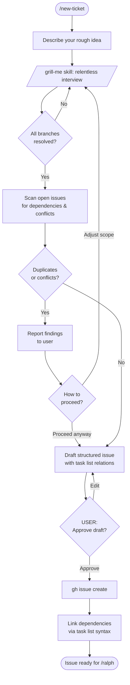
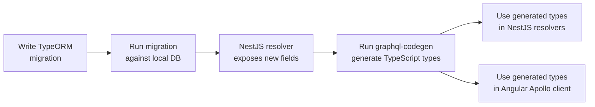
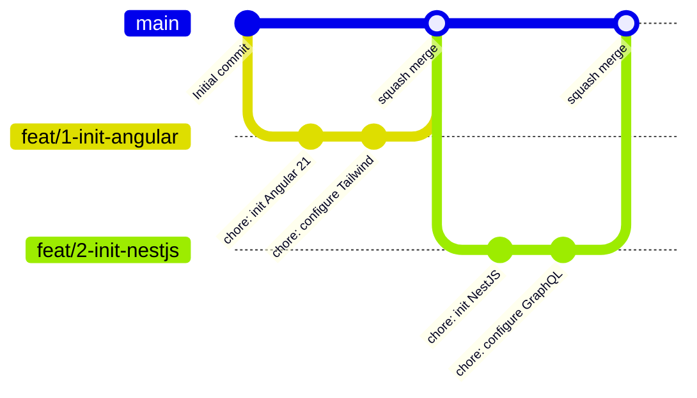

# Agent Orchestration Workflow

This document describes how to develop features in this project using AI agent orchestration. No application code is written manually — all development is driven through the Ralph loop.

---

## Overview

Two workflows are available:

| Workflow | Command | Purpose |
|----------|---------|---------|
| Requirements Engineering | `/new-ticket` | Turn a rough idea into a structured GitHub Issue |
| Ralph Execution Loop | `/ralph [#issue] [flags]` | Implement a ticket end-to-end |

**Flags for `/ralph`:**

| Flag | Spec Approval | PR Creation | Merge |
|------|---------------|-------------|-------|
| *(none)* | ✅ User approves | ⏭️ Auto | ❌ Manual |
| `--auto-merge` | ✅ User approves | ⏭️ Auto | ✅ Auto |
| `--auto` | ⏭️ Skipped (spec still saved) | ⏭️ Auto | ✅ Auto |

By default, spec approval is human-in-the-loop. PR creation is automatic after verification passes. Use `--auto` for fully autonomous operation.

---

## Workflow 1: Requirements Engineering (`/new-ticket`)

Use this before any development work. Well-structured tickets are the fuel that makes the Ralph loop effective.



### What the interview covers

The `grill-me` skill walks through every branch of the design tree:

- **User story** — who benefits, what they want, why
- **Acceptance criteria** — specific, testable, maps directly to E2E test cases
- **Affected layers** — database, backend, frontend, or all three
- **Edge cases** — invalid input, network failures, auth errors
- **Scope boundaries** — what is explicitly NOT in this ticket
- **Design / UX** — PrimeNG components, layout, mockups

### Dependency tracking

Dependencies are stored as GitHub task list relations:

```markdown
### Dependencies
- [ ] #3 — requires auth service to be complete
- [ ] #7 — needs user table migration
```

GitHub renders these as tracked relationships. Agents check them programmatically before picking a ticket — a ticket with unresolved dependencies won't be auto-selected.

---

## Workflow 2: Ralph Execution Loop (`/ralph`)

```mermaid
flowchart TD
    A(["/ralph &#91;#issue&#93; &#91;flags&#93;"]) --> B{Issue\nspecified?}
    B -->|Yes #N| D
    B -->|No| C[Read progress.txt\nfor in-progress work]
    C --> C1{In-progress\nwork found?}
    C1 -->|Yes| C2[Offer to resume\nor pick new ticket]
    C1 -->|No| C3[Fetch open issues via gh]
    C3 --> C4[Check dependency status\nfor each issue]
    C4 --> C5[AI picks highest-priority\nunblocked issue]
    C2 --> D[Fetch full issue details]
    C5 --> D

    D --> E[Extract structured spec\ninto specs/N.md]
    E --> F{--auto\nflag?}
    F -->|No| F1{USER:\nApprove spec?}
    F1 -->|Edit| E
    F1 -->|Approve| G
    F -->|Yes| G[Create worktree\n+ feature branch]

    G --> H[[Implementer Agent]]
    H --> H1[Phase 1: Plan\nidentify layers & order]
    H1 --> H2[Phase 2: Generate\nE2E tests first, then code]
    H2 --> H3[Phase 3: Backpressure\nlint → format → unit → e2e]
    H3 --> H4{All checks\npass?}
    H4 -->|Yes| H5[Phase 4: Document\nupdate progress.txt]
    H4 -->|Fail after 3 attempts| FAIL

    FAIL[/Post diagnostic comment\non GitHub Issue/] --> FAIL2{USER:\nRecovery strategy?}
    FAIL2 -->|New instructions| H2
    FAIL2 -->|Hard reset + retry| G
    FAIL2 -->|Re-ticket| Z([Abandon — create new issue])

    H5 --> I[[Verifier Agent]]
    I --> I1[Read spec + git diff]
    I1 --> I2[Check each acceptance criterion]
    I2 --> I3[Run full test suite]
    I3 --> I4[Produce verification report]
    I4 --> V{Verification\npassed?}
    V -->|No| FAIL
    V -->|Yes| K["gh pr create\n(body includes Closes #N)"]
    K --> L[Update progress.txt]
    L --> M{--auto-merge\nor --auto?}
    M -->|Yes| N["gh pr merge --squash --delete-branch\n+ fallback issue close"]
    M -->|No| O([Done — manual merge])
    N --> P([Done — merged & branch deleted & issue closed])
```



### Phase breakdown

#### Phase 1: Planning (Coordinator)
1. Reads `progress.txt` and `git log` for context
2. Selects or validates the target ticket
3. Checks that dependencies are resolved
4. Extracts a structured spec — **you approve this before any code is written**

#### Phase 2: Implementation (Implementer)
Four phases in strict order:

1. **Plan** — identifies affected layers, proposes implementation order
2. **Generate** — E2E tests from acceptance criteria first, then migration → backend → frontend
3. **Backpressure** — runs lint, format, unit tests, E2E tests iteratively (max 3 attempts per failure before escalating)
4. **Document** — updates `progress.txt`, prepares PR description content

#### Phase 3: Verification (Verifier)
Independent check against the spec:
- Maps each acceptance criterion to evidence in the code or tests
- Runs the full validation pipeline
- Produces a PASS/FAIL report per criterion
- **If verification fails:** loop stops — no PR, no merge. Diagnostic posted, user intervenes.

#### Phase 4: Ship
- **PR is auto-created** after verification passes (no user gate). PR body always includes `Closes #N`.
- **Default:** User reviews PR and squash merges manually on GitHub.
- **`--auto-merge`:** PR is auto-merged via API after creation.
- **`--auto`:** Same as `--auto-merge` (spec approval was already skipped in Phase 1).
- After API merge, fallback-close the issue if `Closes #N` didn't trigger.

### Bootstrap vs Standard Phase

The coordinator auto-detects the project phase by checking for `package.json`:

| Phase | When | Behaviour |
|-------|------|-----------|
| **Bootstrap** | No `package.json` in repo | Used for stack setup tickets. No test/lint backpressure. Focus on correct initialisation. |
| **Standard** | `package.json` exists | Full workflow: E2E-first, schema-first, full validation pipeline. |

The first few tickets (initialise Angular 21, initialise NestJS, configure tooling) run in Bootstrap phase and create the foundation that Standard phase depends on.

---

## Schema-First Development (Standard Phase)

All database-touching features follow this exact order:



**Never hand-write GraphQL types.** They are always generated from the database schema via codegen.

---

## Git Strategy



- Each ticket gets a **worktree** and a **feature branch**
- Many small commits on the feature branch (rich history)
- **Squash merge** to main — one commit per feature, remote branch deleted after merge
- The PR description is the permanent knowledge artifact — searchable, structured, linked to the issue

---

## Recovery When Things Go Wrong

When the implementer hits 3 failed attempts on the same check, it stops and posts a diagnostic comment on the GitHub Issue:

```
DIAGNOSTIC — Issue #42 — attempt 3 of 3

Error: E2E test "user can update profile" failing
Cause: Apollo cache not updating after mutation
Tried:
  1. Added refetchQueries to mutation
  2. Updated cache directly via writeQuery
  3. Forced re-fetch via client.resetStore()

Requesting human guidance.
```

You then choose:

| Option | When to use |
|--------|-------------|
| **New instructions** | You know what to try next |
| **Hard reset + retry** | Too tangled — start fresh with a refined spec |
| **Re-ticket** | Wrong approach entirely — create a better ticket with learnings |

---

## File Reference

| File | Purpose |
|------|---------|
| `CLAUDE.md` | Project conventions and agent rules |
| `progress.txt` | Cross-session memory (gitignored) |
| `specs/<N>.md` | Extracted ticket spec (gitignored, local only) |
| `.claude/agents/coordinator.md` | Ralph loop orchestrator |
| `.claude/agents/implementer.md` | Four-phase coding agent |
| `.claude/agents/verifier.md` | Pre-merge verification |
| `.claude/agents/requirements-engineer.md` | Ticket writing with grill-me |
| `.claude/commands/ralph.md` | `/ralph` entry point |
| `.claude/commands/new-ticket.md` | `/new-ticket` entry point |
| `.claude/commands/verify.md` | `/verify` entry point |
| `.github/ISSUE_TEMPLATE/` | Structured issue forms |
| `.github/PULL_REQUEST_TEMPLATE.md` | PR knowledge artifact |
