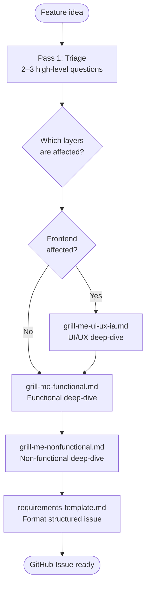
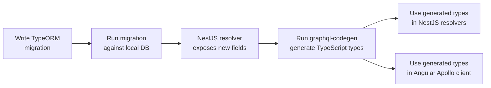
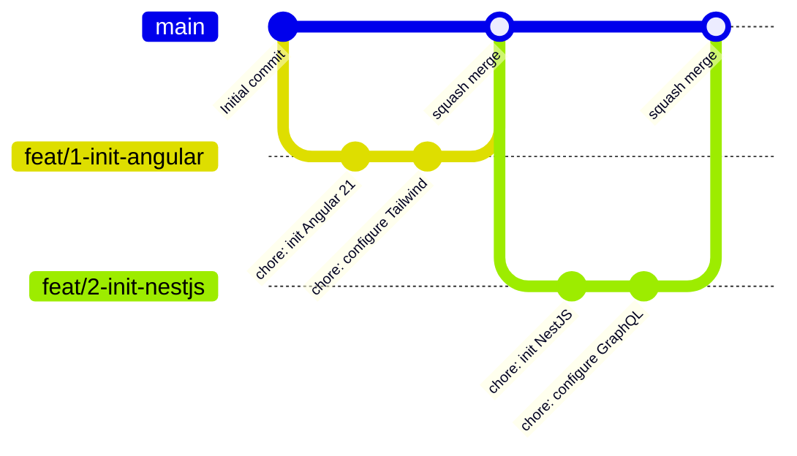

# Agent Orchestration Workflow

This document describes how to develop features in this project using AI agent orchestration. No application code is written manually — all development is driven through the Ralph loop.

---

## Overview

Two workflows are available:

| Workflow | Command | Purpose |
|----------|---------|---------|
| Requirements Engineering | `/new-ticket` | Turn a rough idea into a structured GitHub Issue |
| Ralph Execution Loop | `/ralph [#issue] [flags]` | Implement a ticket end-to-end |

**Flags for `/ralph`:**

| Flag | Spec Approval | PR Creation | Merge |
|------|---------------|-------------|-------|
| *(none)* | ✅ User approves | ⏭️ Auto | ❌ Manual |
| `--auto-merge` | ✅ User approves | ⏭️ Auto | ✅ Auto |
| `--auto` | ⏭️ Skipped (spec still saved) | ⏭️ Auto | ✅ Auto |

By default, spec approval is human-in-the-loop. PR creation is automatic after verification passes. Use `--auto` for fully autonomous operation.

---

## Workflow 1: Requirements Engineering (`/new-ticket`)

Use this before any development work. Well-structured tickets are the fuel that makes the Ralph loop effective.


### What the interview covers

The `grill-me` skill uses a two-pass interview process (see [Skill Architecture](#skill-architecture) for details):

1. **Triage** — 2–3 questions to identify scope and affected layers
2. **Domain deep-dives** — sequential sub-modules covering:
   - **UI/UX & IA** (if frontend affected) — PrimeNG components, layout, user flows
   - **Functional** (always) — user stories, acceptance criteria, edge cases, business rules
   - **Non-functional** (always) — performance, security, scalability

### Dependency tracking

Dependencies are stored as GitHub task list relations:

```markdown
### Dependencies
- [ ] #3 — requires auth service to be complete
- [ ] #7 — needs user table migration
```

GitHub renders these as tracked relationships. Agents check them programmatically before picking a ticket — a ticket with unresolved dependencies won't be auto-selected.

---

## Workflow 2: Ralph Execution Loop (`/ralph`)


### Phase breakdown

#### Phase 1: Planning (Coordinator)
1. Reads `progress.txt` and `git log` for context
2. Selects or validates the target ticket
3. Checks that dependencies are resolved
4. Extracts a structured spec — **you approve this before any code is written**

#### Phase 2: Implementation (Implementer)
Four phases in strict order:

1. **Plan** — identifies affected layers, proposes implementation order
2. **Generate** — E2E tests from acceptance criteria first, then migration → backend → frontend
3. **Backpressure** — runs lint, format, unit tests, E2E tests iteratively (max 3 attempts per failure before escalating)
4. **Document** — updates `progress.txt`, prepares PR description content

#### Phase 3: Verification (Verifier)
Independent check against the spec:
- Maps each acceptance criterion to evidence in the code or tests
- Runs the full validation pipeline
- Produces a PASS/FAIL report per criterion
- **If verification fails:** loop stops — no PR, no merge. Diagnostic posted, user intervenes.

#### Phase 4: Ship
- **PR is auto-created** after verification passes (no user gate). PR body always includes `Closes #N`.
- **Default:** User reviews PR and squash merges manually on GitHub.
- **`--auto-merge`:** PR is auto-merged via API after creation.
- **`--auto`:** Same as `--auto-merge` (spec approval was already skipped in Phase 1).
- After API merge, fallback-close the issue if `Closes #N` didn't trigger.

### Bootstrap vs Standard Phase

The coordinator auto-detects the project phase by checking for `package.json`:

| Phase | When | Behaviour |
|-------|------|-----------|
| **Bootstrap** | No `package.json` in repo | Used for stack setup tickets. No test/lint backpressure. Focus on correct initialisation. |
| **Standard** | `package.json` exists | Full workflow: E2E-first, schema-first, full validation pipeline. |

The first few tickets (initialise Angular 21, initialise NestJS, configure tooling) run in Bootstrap phase and create the foundation that Standard phase depends on.

---

## Skill Architecture

Agent knowledge is organised as a **two-tier skill system** following the Praetorian "Thin Agent, Fat Platform" pattern:

### Tier 1 — Core (CLAUDE.md)

`CLAUDE.md` contains only project-wide constants that every agent needs on every turn:

- Monorepo structure and pnpm conventions
- Git workflow (branch naming, commit messages, PR rules)
- Cross-session memory (`progress.txt`, issue body = spec)
- A **safety-net fallback**: "if you don't know, ask a gateway"

No domain knowledge lives here — it stays under 60 lines.

### Tier 2 — Skill Library (.claude/skills/)

Domain knowledge is stored in 14 standalone skill files. Each skill is a self-contained reference document that agents load on demand:

| Skill | File | Domain |
|-------|------|--------|
| NestJS Quality | `nestjs-quality.md` | Module structure, providers, guards, DI patterns |
| Schema-First Flow | `schema-first-flow.md` | Migration → entity → codegen workflow |
| GraphQL Architecture | `graphql-architecture.md` | Resolver design, DTOs, code-first schema |
| Angular Quality | `angular-quality.md` | Component architecture, signals, standalone components |
| PrimeNG Patterns | `primeng-patterns.md` | UI component usage, theming, form integration |
| Tailwind Conventions | `tailwind-conventions.md` | Utility-first CSS, responsive design, tokens |
| E2E-First | `e2e-first.md` | Test-driven workflow, test pyramid, strategy |
| Vitest Patterns | `vitest-patterns.md` | Unit/integration testing, mocking, assertions |
| Playwright Conventions | `playwright-conventions.md` | Browser automation, page objects, selectors |
| Grill-Me (Orchestrator) | `grill-me.md` | Two-pass requirements interview process |
| Grill-Me: UI/UX & IA | `grill-me-ui-ux-ia.md` | Frontend UI and information architecture questions |
| Grill-Me: Functional | `grill-me-functional.md` | Business logic and edge case questions |
| Grill-Me: Non-Functional | `grill-me-nonfunctional.md` | Performance, security, scalability questions |
| Requirements Template | `requirements-template.md` | Structured GitHub Issue formatting |

### Gateway Agents

Four **gateway agents** sit between the working agents and the skill library. A gateway receives a natural-language query, classifies the intent, and returns the relevant skill file paths with a one-line context hint. Working agents never hard-code skill paths — they ask the gateway.

| Gateway | File | Skills Routed |
|---------|------|---------------|
| Backend | `gateway-backend.md` | nestjs-quality, schema-first-flow, graphql-architecture |
| Frontend | `gateway-frontend.md` | angular-quality, primeng-patterns, tailwind-conventions |
| Testing | `gateway-testing.md` | e2e-first, vitest-patterns, playwright-conventions |
| Specs & Requirements | `gateway-specs.md` | grill-me (orchestrator + 3 sub-modules), requirements-template |

```
┌──────────────────────────────────────────────────────┐
│  Working Agents (coordinator, implementer, verifier) │
│  ↕ natural-language query                            │
├──────────────────────────────────────────────────────┤
│  Gateway Agents (backend, frontend, testing, specs)  │
│  ↕ file path + context hint                          │
├──────────────────────────────────────────────────────┤
│  Skill Library (.claude/skills/*.md)                 │
└──────────────────────────────────────────────────────┘
```

### Grill-Me Orchestration Flow

The `grill-me` skill uses a **triage → sequential sub-module** pattern:



1. **Triage** — 2–3 questions to map the surface area (user story, affected layers, scope boundary)
2. **UI/UX & IA** — invoked only if frontend is affected
3. **Functional** — always invoked (business rules, edge cases, acceptance criteria)
4. **Non-Functional** — always invoked (performance, security, scalability)
5. **Output** — requirements template formats the final GitHub Issue

Sub-modules run **sequentially** — each completes before the next starts. The orchestrator tracks decisions across modules and summarises after each one.

---

## Schema-First Development (Standard Phase)

All database-touching features follow this exact order:



**Never hand-write GraphQL types.** They are always generated from the database schema via codegen.

---

## Git Strategy



- Each ticket gets a **worktree** and a **feature branch**
- Many small commits on the feature branch (rich history)
- **Squash merge** to main — one commit per feature, remote branch deleted after merge
- The PR description is the permanent knowledge artifact — searchable, structured, linked to the issue

---

## Recovery When Things Go Wrong

When the implementer hits 3 failed attempts on the same check, it stops and posts a diagnostic comment on the GitHub Issue:

```
DIAGNOSTIC — Issue #42 — attempt 3 of 3

Error: E2E test "user can update profile" failing
Cause: Apollo cache not updating after mutation
Tried:
  1. Added refetchQueries to mutation
  2. Updated cache directly via writeQuery
  3. Forced re-fetch via client.resetStore()

Requesting human guidance.
```

You then choose:

| Option | When to use |
|--------|-------------|
| **New instructions** | You know what to try next |
| **Hard reset + retry** | Too tangled — start fresh with a refined spec |
| **Re-ticket** | Wrong approach entirely — create a better ticket with learnings |

---

## File Reference

| File | Purpose |
|------|---------|
| `CLAUDE.md` | Core project conventions (~40 lines, no domain knowledge) |
| `progress.txt` | Cross-session memory (gitignored) |
| `specs/<N>.md` | Extracted ticket spec (gitignored, local only) |
| **Agents** | |
| `.claude/agents/coordinator.md` | Ralph loop orchestrator |
| `.claude/agents/implementer.md` | Four-phase coding agent |
| `.claude/agents/verifier.md` | Pre-merge verification |
| `.claude/agents/requirements-engineer.md` | Ticket writing with grill-me |
| **Gateway Agents** | |
| `.claude/agents/gateway-backend.md` | Routes to NestJS, schema-first, GraphQL skills |
| `.claude/agents/gateway-frontend.md` | Routes to Angular, PrimeNG, Tailwind skills |
| `.claude/agents/gateway-testing.md` | Routes to E2E-first, Vitest, Playwright skills |
| `.claude/agents/gateway-specs.md` | Routes to grill-me and requirements skills |
| **Skills** | |
| `.claude/skills/nestjs-quality.md` | NestJS module structure, DI, guards, interceptors |
| `.claude/skills/schema-first-flow.md` | Migration → entity → codegen workflow |
| `.claude/skills/graphql-architecture.md` | Resolver design, DTOs, code-first schema |
| `.claude/skills/angular-quality.md` | Component architecture, signals, standalone |
| `.claude/skills/primeng-patterns.md` | PrimeNG component usage, theming, forms |
| `.claude/skills/tailwind-conventions.md` | Utility-first CSS, responsive design |
| `.claude/skills/e2e-first.md` | Test-driven workflow, test pyramid |
| `.claude/skills/vitest-patterns.md` | Unit/integration testing, mocking |
| `.claude/skills/playwright-conventions.md` | Browser automation, page objects |
| `.claude/skills/grill-me.md` | Requirements interview orchestrator |
| `.claude/skills/grill-me-ui-ux-ia.md` | UI/UX interview sub-module |
| `.claude/skills/grill-me-functional.md` | Functional requirements sub-module |
| `.claude/skills/grill-me-nonfunctional.md` | Non-functional requirements sub-module |
| `.claude/skills/requirements-template.md` | Structured GitHub Issue template |
| **Commands** | |
| `.claude/commands/ralph.md` | `/ralph` entry point |
| `.claude/commands/new-ticket.md` | `/new-ticket` entry point |
| `.claude/commands/verify.md` | `/verify` entry point |
| **GitHub** | |
| `.github/ISSUE_TEMPLATE/` | Structured issue forms |
| `.github/PULL_REQUEST_TEMPLATE.md` | PR knowledge artifact |
